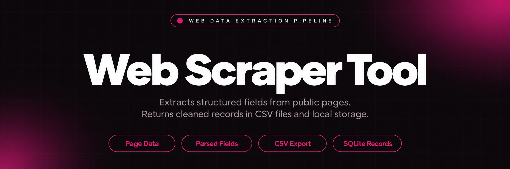
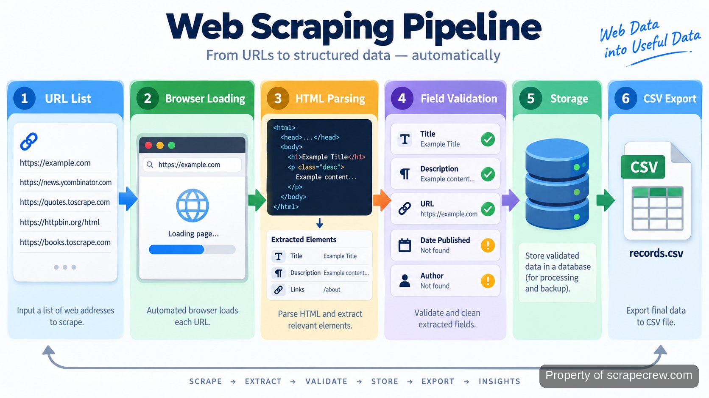

<p align="center">
  <a href="https://www.scrapecrew.com" target="_blank" rel="nofollow">
    
  </a>
</p>

## web scraper

The web scraper repository contains a working extraction system for collecting structured information from public pages and converting it into usable records. The tool runs repeatable collection jobs, applies parsing rules, stores captured fields, and writes export files for later analysis. The project is designed around predictable runs rather than manual copy and paste from individual pages.

> Collect pages, transform fields, and produce structured datasets.

A typical run starts with a list of target URLs, loads each page through the browser layer, identifies required elements, normalizes the captured values, and saves the results. A run that processes 100 pages follows the same pipeline as a smaller test run, making failures easier to identify and rerun.

<a href="https://www.scrapecrew.com" target="_blank" rel="nofollow">
  
</a>

<p align="center">
  <a href="https://t.me/Bitbash333" target="_blank" rel="nofollow">
    
  </a>&nbsp;
  <a href="https://wa.me/923249868488?text=Hi%2C%20I%27m%20interested." target="_blank" rel="nofollow">
    
  </a>&nbsp;
  <a href="mailto:hello@scrapecrew.com" target="_blank" rel="nofollow">
    
  </a>&nbsp;
  <a href="https://www.scrapecrew.com" target="_blank" rel="nofollow">
    
  </a>
</p>



## Data extraction workflow

The collection flow separates page access, extraction rules, and output handling. This keeps a parsing change from affecting storage logic and allows a failed stage to be inspected without rerunning the entire process. The browser layer retrieves page content, the parser identifies fields, and the storage layer preserves the resulting records.

The extraction process follows four practical stages:

- URL intake: target pages are loaded from configured inputs.
- Content capture: page responses are collected through the browser automation layer.
- Field parsing: selectors map page elements into structured values.
- Record export: processed entries are written into files for downstream use.

The approach removes a common scraping failure mode: collecting inconsistent fields because every page was handled manually. For example, a product title, category, and source URL can be stored under the same column names across multiple runs.

## Core Features

| Feature | Description |
| --- | --- |
| Browser-based collection | Pages that require rendered content are loaded through browser automation instead of relying only on raw HTML responses. |
| Structured field parsing | Missing or inconsistent page fields are handled through defined selectors and transformation rules before storage. |
| Dataset export | Collected records are written into CSV files so extracted information can be opened, reviewed, or processed by other tools. |
| Configurable targets | Changing collection targets does not require rewriting the complete extraction flow because URLs and parsing settings remain separated. |
| Run logging | Failed pages and processing details are recorded so interrupted jobs can be reviewed after execution. |

## Python scraping implementation

The project uses Python as the main runtime because the ecosystem provides mature libraries for browser automation, HTTP handling, parsing, and file processing. The browser layer uses <a href="https://playwright.dev/python/docs/intro" target="_blank" rel="nofollow">Playwright documentation</a> for controlled page loading, while parsing components can rely on <a href="https://www.crummy.com/software/BeautifulSoup/bs4/doc/" target="_blank" rel="nofollow">Beautiful Soup documentation</a> for HTML analysis.

The repository structure separates configuration from execution code. This makes it possible to update target URLs or selectors without moving logic between files. Python's standard library tools support local processing, while <a href="https://docs.python.org/3/" target="_blank" rel="nofollow">Python documentation</a> provides references for runtime behavior and packaging.

The storage layer uses SQLite for lightweight local persistence. SQLite is suitable for keeping extracted records, job history, and debugging information in a single file. The database behavior follows the official <a href="https://www.sqlite.org/docs.html" target="_blank" rel="nofollow">SQLite documentation</a>.

## Project Directory

```text
scraper-project/
├── src/
│   ├── main.py
│   ├── crawler.py
│   ├── parser.py
│   └── exporter.py
├── config/
│   ├── targets.json
│   └── selectors.json
├── data/
│   ├── records.csv
│   └── scraper.db
├── tests/
│   └── test_parser.py
├── requirements.txt
└── README.md
```

<a href="https://tally.so/r/BzWjZQ?platform=GitHub&amp;format=Product+repo&amp;brand=ScrapeCrew&amp;niche=scraping&amp;page=Web+Scraper+using+Python&amp;date=2026-09-04" target="_blank" rel="nofollow">
  
</a>

## Running extraction jobs

The repository is intended to be operated as a finished project. A new user installs dependencies, updates configuration values, starts a collection run, and reviews generated files. The process does not require changing source code for every extraction task.

## How to Run web scraper

- **STEP 1 — Download & Set Up the Project** Download the project repository, install dependencies, and prepare web scraper to run with the included configuration files.
- **STEP 2 — Open Configuration** Open the project settings and review target URLs, selectors, and output options before starting a collection.
- **STEP 3 — Configure Inputs** Select extraction targets and update fields in targets.json and selectors.json with the pages and data points required.
- **STEP 4 — Run Collection** Execute the run command, then review generated records.csv and database entries created from collected pages.

```bash
python -m src.main

```

## Deployment and maintenance

The repository can run locally or inside a containerized environment. Container support keeps runtime dependencies consistent between machines. The Docker workflow follows the official <a href="https://docs.docker.com/" target="_blank" rel="nofollow">Docker documentation</a> so the same commands can be used across development environments.

Maintenance usually focuses on selector changes, source page changes, and output validation. A page redesign can affect extraction rules, so the parser tests provide a place to verify expected fields before a full run. The project records failed URLs instead of hiding incomplete results.

For responsible collection practices, operators can review site access rules through <a href="https://developers.google.com/search/docs/crawling-indexing/robots/intro" target="_blank" rel="nofollow">robots.txt guidance from Google</a> and use appropriate request behavior for each source.

## Use Cases

- Research teams can collect structured page information into CSV files instead of manually copying repeated fields from many URLs.
- Developers can maintain recurring extraction jobs where the same page fields need to be collected after configuration changes.
- Analysts can review stored records in SQLite before moving cleaned datasets into another processing system.

## Output formats and validation

The primary output is structured data that can be inspected after each run. CSV export provides a simple handoff format, while local database storage keeps additional context for debugging. A generated record can contain source URL, extracted fields, timestamps, and processing status.

Validation checks focus on whether expected fields were captured. A page missing a required title or identifier can be marked for review instead of silently entering incomplete data. This reduces the risk of downstream files containing unnoticed gaps.

The repository also follows common data handling practices described in resources such as the <a href="https://www.w3.org/TR/vocab-dqv/" target="_blank" rel="nofollow">W3C data quality vocabulary</a> for thinking about completeness and consistency.

## Repository notes

The project is organized for developers who need visibility into each processing stage. Configuration files show what is collected, parser files show how values are found, and export modules show how results leave the system.

A normal run can be tested with a small set of URLs before expanding to larger collections. This makes selector changes easier to verify and keeps debugging focused on one part of the pipeline at a time.

```bash
python -m pytest
python -m src.main

```

## FAQ

### How does the scraper handle changing website layouts?

The scraper handles layout changes through configurable selectors and parser rules. When a source page changes, the extraction settings can be reviewed and updated without changing every part of the processing pipeline.

### Can the tool export extracted records into CSV files?

Yes. The tool writes collected records into CSV output files after processing. The exported dataset can include captured fields, source references, and processing details needed for review.

### What technology stack does the repository use?

The repository uses Python with browser automation, HTML parsing, local database storage, and container support. The stack combines Playwright, parsing libraries, SQLite, and Docker-based environment management.

<table>
  <tr>
    <td align="center" width="33%">
      
      <p>This scraper helped me gather thousands of posts effortlessly. The setup was fast, and exports are super clean and well-structured.</p>
      <p><b>Nathan Pennington</b><br>Marketer<br>★★★★★</p>
    </td>
    <td align="center" width="33%">
      
      <p>What impressed me most was how accurate the extracted data is. Likes, comments, timestamps — everything aligns perfectly.</p>
      <p><b>Greg Jeffries</b><br>SEO Affiliate Expert<br>★★★★★</p>
    </td>
    <td align="center" width="33%">
      
      <p>It's by far the best tool I've used. Ideal for trend tracking, competitor monitoring, and influencer insights.</p>
      <p><b>Karan</b><br>Digital Strategist<br>★★★★★</p>
    </td>
  </tr>
</table>